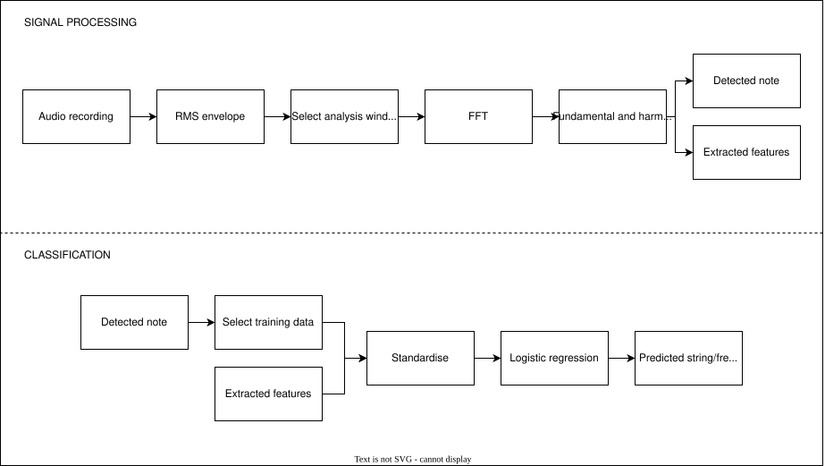

# String/Fret Localisation for Classical Guitar

## Aim

The same musical note can be played at multiple string/fret positions on a guitar. For example, **E4** can be played as:

- string 1, fret 0;
- string 2, fret 5;
- string 3, fret 9.

Although these positions produce approximately the same fundamental frequency, they differ in **timbre** because the physical string and vibrating length are different.

This project investigates whether the **string/fret position of an isolated classical-guitar note can be inferred directly from its audio recording**.

The proof of concept considers five notes and their alternative playing positions within frets 0–12.

**Input:** a recording of a single isolated plucked note on a classical guitar in standard tuning.

**Output:** the predicted string and fret position.

---

## Physical and Signal Features

Timbre describes the perceptual quality or *colour* of a sound. Relevant contributors include:

- the distribution of harmonic energy;
- the physical properties of the vibrating string;
- temporal characteristics such as attack and decay.

### Harmonic Amplitude Ratios

A plucked string produces energy at the fundamental frequency and at higher harmonics or partials. Different string/fret positions can produce different relative harmonic amplitudes.

Ratios such as

$$
\frac{H_2}{H_1}, \qquad
\frac{H_3}{H_1}, \qquad
\frac{H_4}{H_1}
$$

therefore provide amplitude-independent measures of spectral shape.

More generally,

$$
R_{m,n} = \frac{H_m}{H_n}
$$

where \(H_m\) and \(H_n\) are the amplitudes of harmonics \(m\) and \(n\).

For \(m>n\), a larger ratio indicates greater relative energy in the higher-frequency harmonic and may therefore be associated with a brighter timbre.

### Spectral Centroid

Spectral centroid represents the weighted mean frequency of a spectrum and is commonly associated with perceived brightness.

For a spectrum containing \(N\) frequency bins,

$$
C =
\frac{
\sum_{k=0}^{N-1} f_k |X_k|
}{
\sum_{k=0}^{N-1} |X_k|
}
$$

where:

- \(X_k\) is the magnitude of frequency bin \(k\);
- \(f_k\) is the frequency corresponding to that bin.

For a sampling frequency \(f_s\) and FFT size \(N\),

$$
f_k = \frac{k f_s}{N}
$$

A higher spectral centroid indicates that a larger proportion of the spectral magnitude is concentrated at higher frequencies.

### Spectral Roll-off

Spectral roll-off measures the frequency below which a specified proportion of the spectrum lies.

For roll-off proportion \(p\), the roll-off bin \(M\) satisfies

$$
\sum_{k=0}^{M} |X_k|
\geq
p \sum_{k=0}^{N-1} |X_k|
$$

where \(p\) is commonly chosen between approximately \(0.85\) and \(0.95\).

The roll-off frequency is then

$$
f_{\text{rolloff}} = \frac{M f_s}{N}
$$

An **85% roll-off threshold** was explored in this project as another measure of spectral distribution.

### Harmonic-Frequency Deviation

Real strings are not perfectly flexible, so their partial frequencies do not necessarily occur at exact integer multiples of the fundamental. Finite stiffness causes higher vibration modes to shift from the ideal harmonic series.

For a stiff string, the frequency of the \(n\)-th partial can be approximated by

$$
f_n = n f_1 \sqrt{1 + Bn^2}
$$

where \(B\) is the string's inharmonicity coefficient.

A simplified expression for \(B\) depends on physical parameters including Young's modulus, string diameter, vibrating length and tension:

$$
B \propto \frac{Qd^4}{Tl^2}
$$

where:

- \(Q\) is Young's modulus;
- \(d\) is string diameter;
- \(l\) is vibrating length;
- \(T\) is string tension.

These physical parameters are not supplied to the classifier because the aim is to infer playing position from **audio alone**.

Instead, the project uses the **mean relative harmonic deviation** from the ideal harmonic series:

$$
D =
\frac{1}{N-1}
\sum_{n=2}^{N}
\frac{|f_n - n f_1|}{n f_1}
$$

This is used as an audio-derived proxy for inharmonic behaviour rather than as a direct estimate of \(B\).

### Temporal Envelope

The RMS amplitude envelope was also investigated.

String construction and vibrating length may influence attack, decay and sustain behaviour, but these characteristics are also sensitive to variations in the pluck itself.

Temporal analysis was therefore treated as an exploratory feature family rather than assumed to provide reliable separation.

The candidate feature families investigated were:

- harmonic amplitudes and harmonic-amplitude ratios;
- mean relative harmonic deviation;
- spectral centroid;
- spectral roll-off;
- RMS temporal-envelope characteristics.

---

## Recording Methodology

### Controlling Recording Variation

To reduce unwanted variation between recordings:

- the same microphone and microphone position were used throughout;
- a **0.71 mm plectrum** was used instead of fingers;
- the absolute plucking location was kept fixed at approximately the centre of the sound hole;
- recordings for the three positions corresponding to a particular note were collected in the same session.

Fixing the plucking position was intended to reduce timbral changes caused by moving the pluck closer to the bridge or fretboard.

### Proof-of-Concept Note Selection

The dataset was intentionally constrained to **five notes and 15 string/fret positions**, with three alternative positions per note.

This allowed physically motivated features to be investigated in a controlled setting before attempting full-fretboard classification.

| Note | String/fret positions | Purpose |
|---|---|---|
| E4 | S1 F0, S2 F5, S3 F9 | Open vs fretted nylon strings |
| D3 | S4 F0, S5 F5, S6 F10 | Open vs fretted wound strings |
| F4 | S1 F1, S2 F6, S3 F10 | Fretted nylon strings |
| E3 | S4 F2, S5 F7, S6 F12 | Fretted wound strings |
| G3 | S3 F0, S4 F5, S5 F10 | Nylon vs wound strings |

The initial dataset contained **five recordings per position** and was later expanded during development.

---

## Data Preprocessing

### Audio Format

Recordings were captured as **48 kHz M4A** files using a smartphone and converted to **WAV** before analysis.

WAV provides straightforward access to uncompressed PCM samples, avoiding additional codec-decoding steps and reducing the influence of lossy compression on spectral and harmonic measurements.

Mono audio was used because only a single waveform was required for the analysis.

Files followed the naming convention:

```text
{note}_S{string}_F{fret}_{take}.wav
```

For example:

```text
E4_S2_F5_03.wav
```

### Metadata and Analysis Window

`extract_metadata.py` parses the:

- note;
- string;
- fret;
- take number;

from each filename and determines the RMS peak time of the plucked note.

The spectral-analysis window begins **0.25 s after the RMS peak** and lasts **0.5 s**:

$$
t_{\text{start}} = t_{\text{RMS peak}} + 0.25
$$

$$
t_{\text{end}} = t_{\text{start}} + 0.50
$$

Moving the window beyond the initial attack reduces the influence of pluck transients while retaining a sufficiently strong portion of the sustained signal for harmonic analysis.


### Temporal Feature Investigation

Temporal-envelope features were initially explored using attack, decay and
secondary-peak behaviour.

Some positions appeared separable in the initial five-recording dataset.
However, after expanding the dataset to ten recordings per position, the
distributions showed substantially greater overlap.

Mean ± standard-deviation RMS-envelope comparisons also showed that the
usefulness of temporal behaviour varied considerably between notes and was
sensitive to within-position plucking variation.

Temporal features were therefore not included in the final classifier, with
the classifier instead prioritising spectral and harmonic features.

A more detailed account of this investigation is available in the
[development log](docs/development_log.pdf).


## Feature Extraction

Each recording was reduced to a fixed-length feature vector derived from the **0.5 s analysis window**.

A **Fast Fourier Transform (FFT)** was first applied to obtain the frequency spectrum. The fundamental and first five harmonic peaks were then identified, providing both their frequencies and amplitudes.

From these measurements, a larger exploratory set of physically motivated features was generated, including:

- harmonic amplitude ratios;
- harmonic centroid;
- spectral centroid;
- spectral roll-off;
- mean relative harmonic deviation;
- pitch-error measurements for data-quality checking.

The extracted features from all recordings were stored in `features.csv`, allowing their distributions to be compared across the three possible positions for each note.

### Exploratory Feature Selection

Single-feature and two-feature scatter plots were initially used to investigate which measurements contained useful discriminative information.

The strongest feature combinations varied substantially between notes:

- **D3** could be separated effectively using harmonic ratios;
- **E3** benefited from complementary separation between `h3/h1` and spectral centroid;
- **F4** showed strong separation using combinations of harmonic ratios and spectral/harmonic centroid;
- **E4** exhibited considerably greater overlap and could not be cleanly separated using only one or two features;
- **G3** showed useful clustering but also exposed some overlap and later cross-session distribution shift.

This made fixed manually selected thresholds unsuitable for the overall task. Instead, several complementary features were retained and used together in a classifier.

The final feature vector is:

| Feature | Description |
|---|---|
| `h2_h1` | Second-harmonic amplitude relative to the fundamental |
| `h3_h1` | Third-harmonic amplitude relative to the fundamental |
| `h4_h1` | Fourth-harmonic amplitude relative to the fundamental |
| `h5_h1` | Fifth-harmonic amplitude relative to the fundamental |
| `log_h3_h2` | Log-transformed relative amplitude of the third and second harmonics |
| `spectral_centroid` | Magnitude-weighted mean frequency of the spectrum |
| `harmonic_centroid` | Amplitude-weighted centroid calculated using detected harmonics |
| `mean_relative_harmonic_deviation` | Mean relative deviation of measured partials from an ideal harmonic series |

### Stabilising the Harmonic Ratio

The raw ratio

$$
\frac{H_3}{H_2}
$$

was initially useful for separating some string/fret positions.

However, later-session testing showed that it could become numerically unstable when \(H_2\) was very small, producing extremely large ratios and disproportionately affecting distances in the feature space.

It was therefore replaced by a logarithmic ratio:

$$
R_{\log}
=
\ln\left(
\frac{H_3 + \epsilon}{H_2 + \epsilon}
\right)
$$

where \(\epsilon\) prevents division by zero.

The logarithmic transformation compresses extreme ratios while retaining information about the relative strength of the two harmonics.

---

## Classification Pipeline

Classification is performed in **two stages**.

### 1. Note Identification

The fundamental frequency \(f_0\) of the input recording is estimated from its spectrum and converted to the nearest MIDI note:

$$
m =
69 +
12\log_2
\left(
\frac{f_0}{440}
\right)
$$

The MIDI value is then mapped to its musical note.

Because the proof-of-concept dataset contains **three candidate string/fret positions per supported note**, identifying the note reduces the classification problem from 15 possible positions to three.

### 2. String/Fret Classification

The same eight spectral and harmonic features used during training are extracted from the input recording.

For the detected note, only the corresponding training examples are selected.

Before classification, each feature is standardised:

$$
z =
\frac{x-\mu}{\sigma}
$$

where:

- \(x\) is the original feature value;
- \(\mu\) is the training-set mean;
- \(\sigma\) is the training-set standard deviation.

This prevents features with large numerical ranges, such as spectral centroid in Hz, from dominating features with smaller numerical values such as harmonic ratios.

### Classifier Development

Several approaches were developed iteratively:

1. **3-nearest-neighbour classification** using Euclidean distance in the standardised feature space;
2. **distance-weighted nearest neighbours**, giving closer observations greater influence;
3. replacement of the unstable raw `h3/h2` ratio with `log_h3_h2`;
4. **logistic regression**;
5. **linear support vector machine (SVM)**.

Later-session testing was particularly useful because it exposed behaviour that was not apparent from within-session cross-validation. In particular, weak second harmonics caused the raw `h3/h2` feature to generate extreme values for some recordings, distorting nearest-neighbour distances.

The logarithmic transformation improved the stability of the feature representation, but some class overlap remained. Logistic regression and a linear SVM were therefore evaluated and both achieved **90% accuracy** on the later-session recordings.

**Logistic regression** was selected for the final pipeline because it matched the SVM's later-session performance while directly providing class probability estimates.

### End-to-End Inference

For a new recording, the final pipeline performs:



In algorithmic terms:

1. load and normalise the waveform;
2. locate the RMS peak and select the spectral-analysis window;
3. calculate the FFT;
4. estimate the fundamental frequency and identify the musical note;
5. locate the first five harmonics;
6. calculate the eight classifier features;
7. select the training examples corresponding to the detected note;
8. standardise the features using the training-set statistics;
9. classify between the note's three candidate string/fret positions using logistic regression;
10. return the predicted position, its model probability, and the next-best position.


## Evaluation

Four classification approaches were compared using **leave-one-out cross-validation (LOOCV)** on the original 150 recordings and evaluation on **30 recordings collected in later sessions**.

| Model | Original LOOCV | Later-session recordings |
|---|---:|---:|
| 3-NN + log ratio | 137/150 (**91.3%**) | 25/30 (**83.3%**) |
| Inverse-square weighted NN + log ratio | 143/150 (**95.3%**) | 25/30 (**83.3%**) |
| Logistic regression + log ratio | 148/150 (**98.7%**) | 27/30 (**90.0%**) |
| Linear SVM + log ratio | 149/150 (**99.3%**) | 27/30 (**90.0%**) |

The nearest-neighbour approaches reached **83.3%** accuracy on the later-session recordings, while logistic regression and a linear SVM both achieved **90.0%**.

The two linear classifiers also produced identical predictions on the later-session dataset. This suggests that the remaining errors were more strongly associated with **feature overlap or cross-session shifts in the extracted feature distributions** than with the choice between these two classifiers.

**Logistic regression** was selected for the final pipeline because it matched the SVM's later-session accuracy while also providing class probability estimates directly through `predict_proba()`.

These probabilities are used to expose the predicted and next-best positions, rather than being treated as calibrated confidence estimates.

> [!IMPORTANT]
> The resulting accuracy should be interpreted as **proof-of-concept performance** for E4, D3, E3, F4 and G3 and the 15 supported string/fret positions. It is not an estimate of performance across the full guitar fretboard or across different instruments, players, microphones or recording environments.

The later-session recordings were repeatedly used during robustness analysis and model comparison. They therefore function as **development/validation data rather than a fully untouched final test set**. A further independent recording session would be required for an unbiased final performance estimate.

### Relation to Previous Work

Previous work has investigated guitar-string identification using both machine-learning and physical-model approaches.

- **Abeßer (2012)** explored automatic string detection for electric and bass guitar.
- **Hjerrild & Christensen (2019)** estimated guitar string, fret and plucking position using parametric pitch models.

This project instead focuses on a deliberately constrained **classical-guitar proof of concept** using physically motivated, audio-derived features such as harmonic amplitude ratios, spectral centroids and harmonic-frequency deviation, followed by lightweight classical classifiers.

The reported results in these papers are therefore useful context, but should **not be compared directly** with the present 90% result because the datasets, instruments, task definitions and evaluation procedures differ.

## Further Detail

A chronological record of feature exploration, failed approaches,
cross-session robustness testing and classifier development is available in
the [development log](docs/development_log.pdf).

## References

1. Abeßer, J. (2012). *Automatic String Detection for Bass Guitar and Electric Guitar*.
2. Hjerrild, J. M. & Christensen, M. G. (2019). *Estimation of Guitar String, Fret and Plucking Position Using Parametric Pitch Estimation*.
3. Fletcher, H. (1964). *Normal Vibration Frequencies of a Stiff Piano String*.
4. Roy, E. (2024). *Investigating the Inharmonicity of Piano Strings*.
5. [UNSW — Strings and Standing Waves](https://www.phys.unsw.edu.au/jw/strings.html)
6. [scikit-learn — LogisticRegression](https://scikit-learn.org/stable/modules/generated/sklearn.linear_model.LogisticRegression.html)
7. [scikit-learn — Support Vector Machines](https://scikit-learn.org/stable/modules/svm.html)
